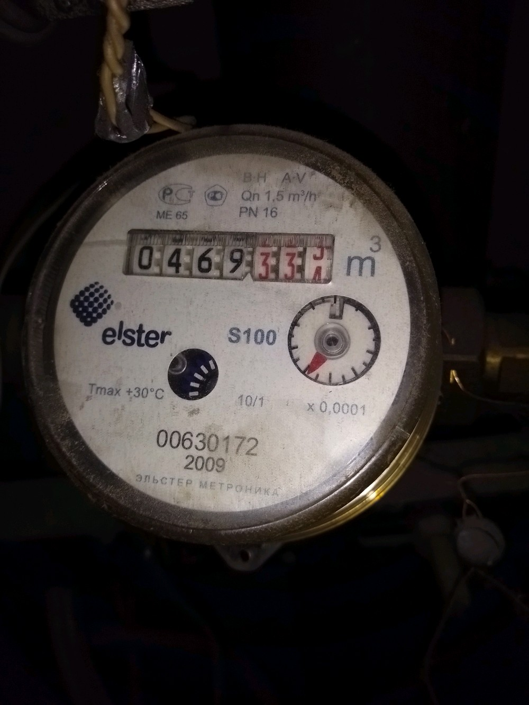
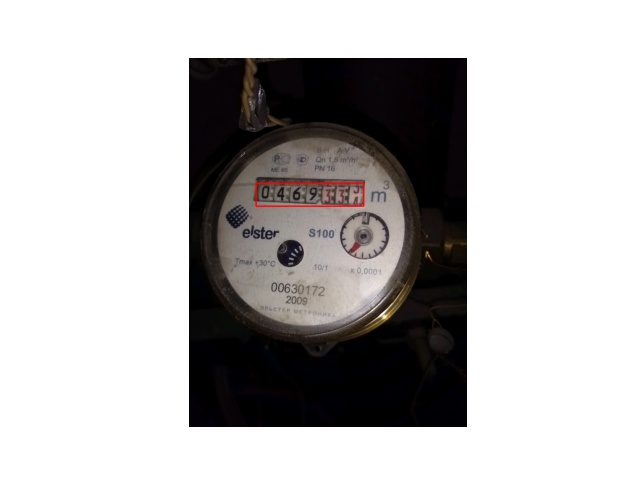
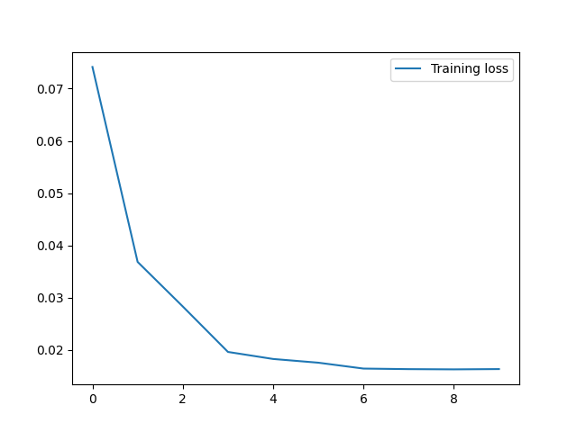
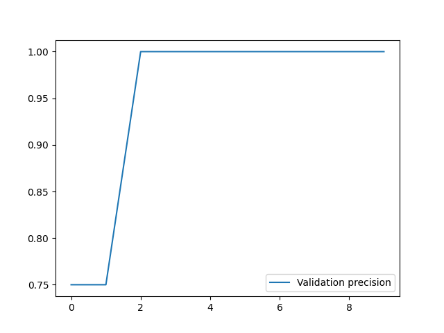

# Water-Meter-Detection

### Introduction

This repository aims to make a Water Meter detection based on the TolokaWaterMeters database, that can be found on the following link: https://toloka.ai/datasets

The method used was a pre-trained torchvision model of the Faster-RCNN.

Example of use:

- Input Image:




- Output Image:




### Installation

Clone repo and install requirements.txt:

```
pip install -r requirements.txt
```


### Prepare Dataset

Download and extract the TlWaterMeters dataset into a path named TlWaterMeters and execute the utils.py script:

```
python3 utils.py --dataset_path ../TlkWaterMeters --output_path .
```

This will produce two directorys inside the output_path parameter: images and bbxs. Both of then contains three directorys: train, test and val. The train directory contains 70% of the data, the test contains 15% and the val contains 15%. 

### Train model

To train a custom model after preparing the dataset, execute the train.py script:

```
python3 train.py --img_path images --bbx_path bbxs
```

This will save a model file in your local directory and will produce the following loss and precision graphs:

 


### Make inferences

After training your model or just using the one provided by this repository, if you want to make inferences on new water meter images, execute the test.py script:

```
python3 test.py --img_path images/val --model fasterrcnn_resnet50_fpn.pth --output_path val_output
```

The input images must be in the img_path directory and the results will be plotted in the output_path directory.

### References

This model was based on the Object Detection tutorial of TorchVision:

- https://pytorch.org/tutorials/intermediate/torchvision_tutorial.html
